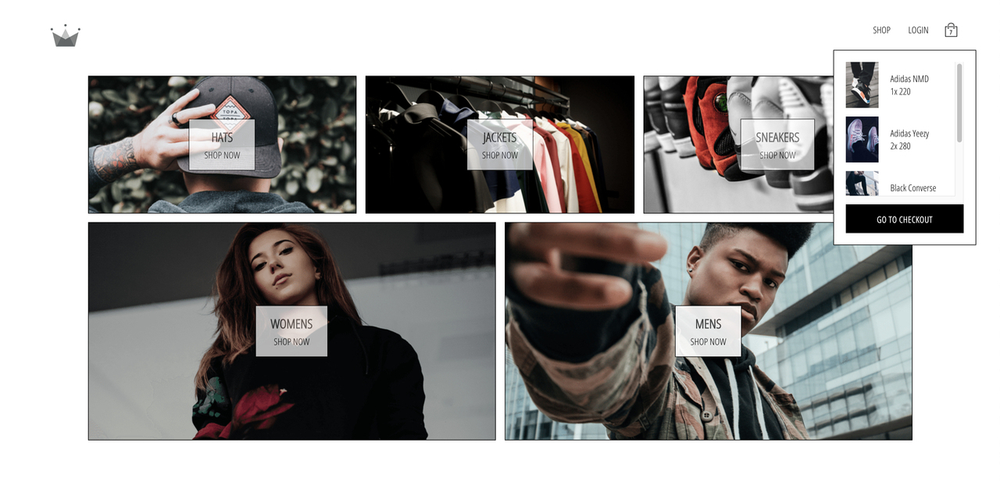

# White Label eCommerce

## Overview

This project was created as part of the ZTM course, [Complete React Developer in 2021](https://academy.zerotomastery.io/p/complete-react-developer-redux-hooks-graphql-zero-to-mastery).

It can be used as a base framework to build a React eCommerce platform.

Current functionality:

- Category previews
- Category pages
- Cart functionality (Add, remove, quantity change, persistence)
- Checkout page with Stripe checkout (Stripe integration)
- User sign-in/sign-up with Google Auth (Firebase integration)
- User sign-in/sign-up with email/password (Firebase integration)
- Mobile responsiveness

Focus has been on experimenting with data and state management using:

- Redux Sagas: [main Branch](https://github.com/matejnavara/White-Label-Ecommerce)
- Redux Thunk: [thunk-implementation Branch](https://github.com/matejnavara/White-Label-Ecommerce/tree/thunk-implementation)
- GraphQL + Apollo: [gql-apollo3-implementation Branch](https://github.com/matejnavara/White-Label-Ecommerce/tree/gql-apollo3-implementation)

The eCommerce usecase provides an effective sandbox to test these out with seed data and defined events. Feel free to extend with other implementations.

## Available Scripts

In the root project directory, you can run:

### `npm run dev`

Runs the app in the development mode.\
Server on port 5000, client on port 3000.
Open [http://localhost:3000](http://localhost:3000) to view it in the browser.

The page will reload if you make edits.\
You will also see any lint errors in the console.

### `npm test`

Launches the test runner in the interactive watch mode.\
See the section about [running tests](https://facebook.github.io/create-react-app/docs/running-tests) for more information.

### `npm build`

Builds the app for production to the `build` folder.\
It correctly bundles React in production mode and optimizes the build for the best performance.

The build is minified and the filenames include the hashes.\
Your app is ready to be deployed!
